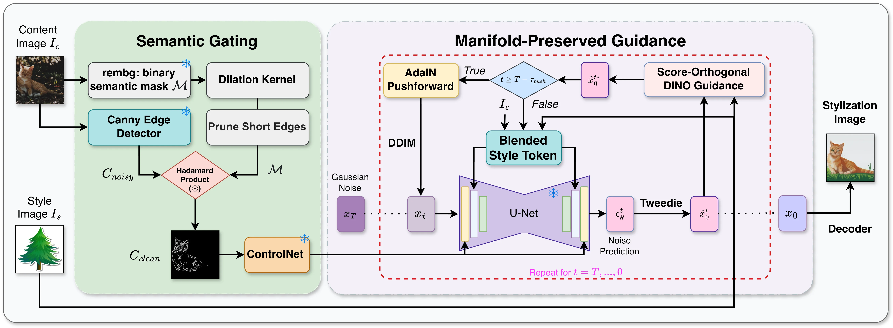

<div align="center">

# OrthoStyle: Manifold-Preserving Training-Free Style Transfer via Score-Orthogonal Guidance

**Anonymous Authors**

</div>

<br>

<div align="center">
    <a href="#"></a>
    <a href="#"></a>
    <a href="#"></a>
</div>

<br>

---
## Overview OrthoStyle Pipeline

<p align="center">
  
</p>

---

## Citation

```bibtex
@article{orthostyle2026,
  title  = {OrthoStyle: Manifold-Preserving Training-Free Style Transfer via Score-Orthogonal Guidance},
  author = {Anonymous},
  year   = {2026}
}